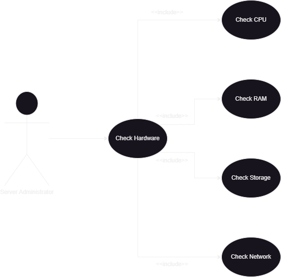

# 🖥️ Server Hardware Monitor

Ein einfaches Python-Tool zur Überwachung der wichtigsten Hardware-Komponenten deines Systems.  
Die Ergebnisse werden übersichtlich in einem Fenster angezeigt.

---

## ✅ Funktionen

- 🧠 Zeigt CPU-Kerne, Taktfrequenz und Auslastung
- 🌬️ Zeigt CPU-Temperatur (erfordert OpenHardwareMonitor)
- 💾 Zeigt RAM-Nutzung
- 💽 Zeigt Festplattennutzung (SSD/HDD)
- 📡 Zeigt Netzwerkaktivität (gesendete & empfangene Daten)

---

## 📦 Voraussetzungen

- Python 3.8 oder höher
- Benötigte Python-Pakete:
  ```bash
  pip install psutil wmi

## 📌 UML Use Case Diagram


